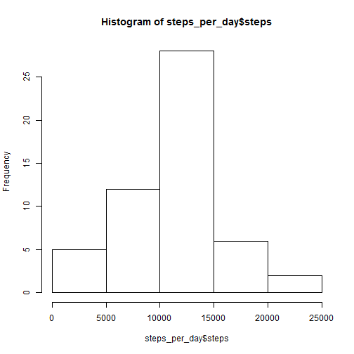
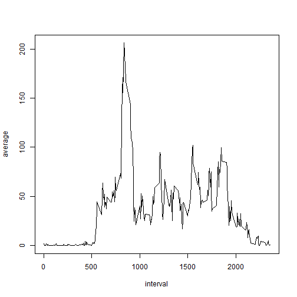
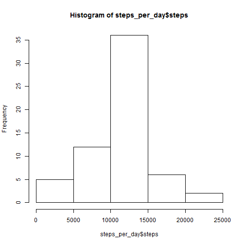
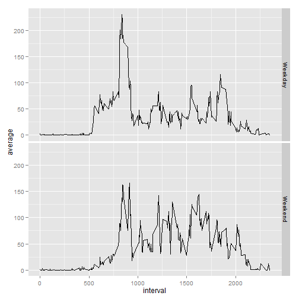

# Reproducible Research: Peer Assessment 1


## Loading and preprocessing the data
In order to load the activity data we must first unzip the activity.zip file in the repository


```r
unzip(zipfile = "activity.zip", overwrite = TRUE)
```


After unzipping the file, we read the in the csv using the standard read.csv function. Using colClasses parameter allows the date to be read in as a date variable rather than a factor.


```r
activity_data <- read.csv(file = "activity.csv", header = TRUE, comment.char = "", 
    stringsAsFactors = FALSE, colClasses = c("integer", "Date", "integer"))
```


The environment now has the activity_data dataframe with 3 variables and 17568 observations. The transformations required for answering each question is handled while answering the question

## What is mean total number of steps taken per day?
To answer this question, I've used the **sqldf** package to build by summary dataset.


```r
library(sqldf)
```

```
## Loading required package: gsubfn
## Loading required package: proto
## Loading required package: RSQLite
## Loading required package: DBI
## Loading required package: RSQLite.extfuns
```

```r
steps_per_day <- sqldf("select date, sum(steps) as steps from activity_data group by date")
```

```
## Loading required package: tcltk
```


Once the steps per day are summed up, we can create simple histogram

```r
hist(x = steps_per_day$steps)
```

 


For calculating the mean and median, we have to exclude the NA records from calculation by using the na.rm parameter


```r
mean(x = steps_per_day$steps, na.rm = TRUE)
```

```
## [1] 10766
```

```r
median(x = steps_per_day$steps, na.rm = TRUE)
```

```
## [1] 10765
```


## What is the average daily activity pattern?
To answer this question, the **sqldf** package is again used to summarize the dataset by intervals


```r
steps_per_interval <- sqldf("select interval, sum(steps) as steps from activity_data group by interval")
```


Accross all intervals there are only 53 days for which there is data. Using this information I've calculated the average using a simple formula and then binding the vector back to the data frame


```r
average <- steps_per_interval$steps/53
steps_per_interval <- cbind(steps_per_interval, average)
```


The steps_per_interval data frame has the average of the interval accross all days against the interval. Now to plot the data


```r
with(steps_per_interval, plot(interval, average, "l"))
```

 


To find the interval with the maximum number of steps on average across all days, we subset the steps_per_interval dataset


```r
steps_per_interval[steps_per_interval$average == max(steps_per_interval$average), 
    "interval"]
```

```
## [1] 835
```


The result shows that the 835th interval has the highest average and the histogram also seems to confirm this answer

## Imputing missing values
The number of missing records in the activity data frame is 2304 as reported by the code chunk below


```r
table(is.na(activity_data))
```

```
## 
## FALSE  TRUE 
## 50400  2304
```


The strategy chosen to impute the values is to use the average of the interval to fill the missing value in the interval. Checking the days on which the data is missing does not reveal any pattern of any specific day or weekday/weekend therefore the average across all days is chosen.

To impute the data, we first merge the activity_data and steps_per_interval data frames based on the intervals. This puts the average of each interval against the original steps data.


```r
imputed_activity_data <- merge(activity_data, steps_per_interval, by = "interval", 
    sort = FALSE)
```


Now we use the ifelse function to replace NA with the corresponding averages.


```r
imputed_activity_data$steps.x = ifelse(is.na(imputed_activity_data$steps.x), 
    imputed_activity_data$average, imputed_activity_data$steps.x)
```


Now to reshape the data frame in the image of the original activity_data


```r
imputed_activity_data <- imputed_activity_data[order(imputed_activity_data$date), 
    c(2, 3, 1)]
names(imputed_activity_data) <- c("steps", "date", "interval")
```


Now to recalculate the sum of steps per day


```r
steps_per_day <- sqldf("select date, sum(steps) as steps from imputed_activity_data group by date")
```


As you can see below, the shape of the histogram has not changed. This means that imputing the values has not changed the distribution


```r
hist(x = steps_per_day$steps)
```

 


However the median has changed a little and is now exactly equal to the mean


```r
mean(x = steps_per_day$steps, na.rm = TRUE)
```

```
## [1] 10766
```

```r
median(x = steps_per_day$steps, na.rm = TRUE)
```

```
## [1] 10766
```


## Are there differences in activity patterns between weekdays and weekends?
First we have to tag the dates as either weekdays or weekends. I'm assuming the weekend means Saturday & Sunday in the code below


```r
part_of_week <- ifelse(weekdays(imputed_activity_data$date) == "Saturday" | 
    weekdays(imputed_activity_data$date) == "Sunday", "Weekend", "Weekday")
```


Now I convert it into a factor and bind it to the imputed data frame 


```r
part_of_week <- as.factor(part_of_week)
imputed_activity_data <- cbind(imputed_activity_data, part_of_week)
```


Once the dates are classified as being weekday or weekend we can now calculate the sum of steps by interval and part_of_week. The count of days is also calculated in this summation to use it in the averages formula


```r
steps_per_interval <- sqldf("select interval, part_of_week, sum(steps) as steps, count(steps) as count from imputed_activity_data group by interval,part_of_week")
average <- steps_per_interval$steps/steps_per_interval$count
steps_per_interval <- cbind(steps_per_interval, average)
```


GGplot2 library is used to plot the data


```r
library(ggplot2)
qplot(x = interval, y = average, data = steps_per_interval, facets = part_of_week ~ 
    ., geom = "line")
```

 


As we can see from the plot, the rise in activity is later in on the weekend starting to rise after 600th interval while on the weekdays the steps increase significantly around the 500 mark. After that the number of steps on the weekend remain higher across the intervals.
